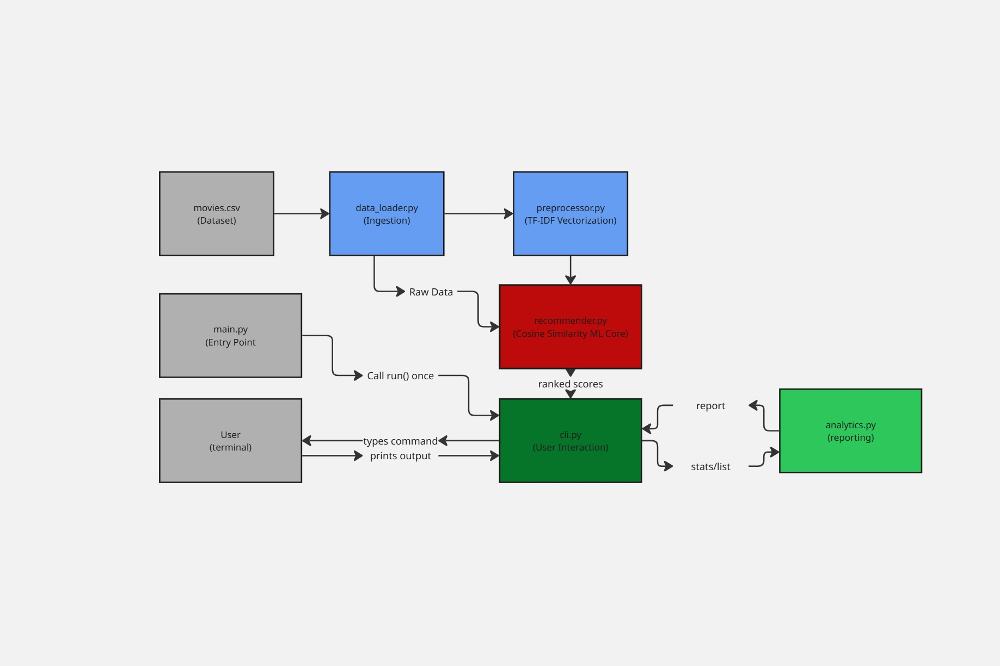
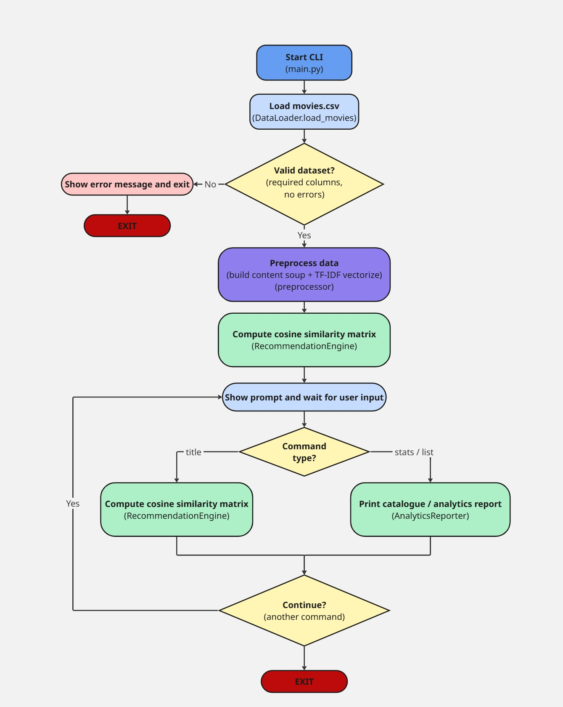
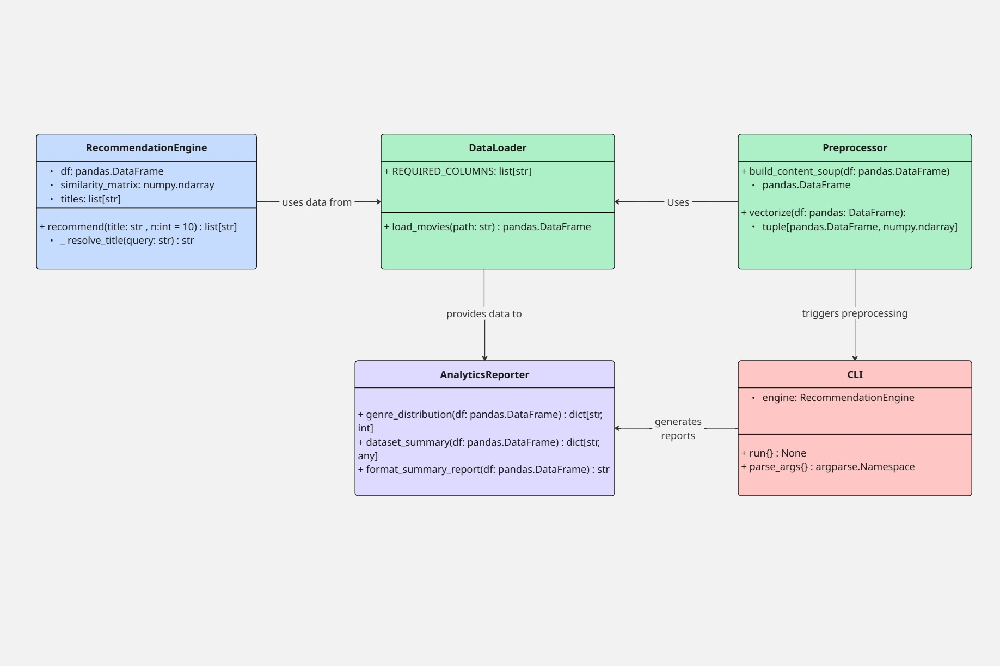

# CineMatch — Content-Based Movie Recommender

CineMatch is a command-line AI/ML application that recommends movies
similar to one you already like, using **content-based filtering**:
each movie's genres and plot overview are turned into a TF-IDF vector,
and recommendations are the nearest neighbours of your chosen movie in
that vector space (cosine similarity).

No external API, internet connection, or GPU is required — everything
runs locally on a small bundled dataset of 40 movies.

## Overview

| | |
|---|---|
| **Type** | AI/ML command-line application |
| **Technique** | TF-IDF vectorization + cosine similarity (content-based filtering) |
| **Language** | Python 3.9+ |
| **Interface** | Interactive terminal (CLI) |
| **Dataset** | Bundled CSV, 40 movies (title, genres, overview) |

## Features

- **Get recommendations** — type any movie title and receive the 5
  most similar movies, ranked by similarity score.
- **Fuzzy title matching** — typos and case differences (e.g.
  `intersteller`) are still resolved to the correct movie.
- **Dataset analytics** — a `stats` command reports genre distribution
  and catalogue-level statistics.
- **Full catalogue listing** — a `list` command shows every movie
  available.
- **Logging** — every session's activity is written to
  `cinematch.log` for auditability.

## Technologies / Tools Used

- Python 3
- pandas — data loading and manipulation
- scikit-learn — `TfidfVectorizer`, `cosine_similarity`
- pytest — automated unit tests
- matplotlib — used offline to generate the design diagrams in `docs/`

## Project Structure

```
cinematch/
├── main.py                    # Entry point
├── requirements.txt
├── statement.md                # Problem statement, scope, target users
├── src/
│   ├── config.py               # Paths & tunable settings
│   ├── logger_config.py        # Shared logger
│   ├── data_loader.py          # Module 1a: dataset ingestion & validation
│   ├── preprocessor.py         # Module 1b: TF-IDF vectorization
│   ├── recommender.py          # Module 2: ML recommendation engine
│   ├── analytics.py            # Module 3a: dataset analytics/reporting
│   └── cli.py                  # Module 3b: interactive CLI
├── data/
│   └── movies.csv              # Bundled dataset (40 movies)
├── tests/
│   └── test_recommender.py     # Unit tests (pytest)
└── docs/
    ├── architecture_diagram.png
    ├── workflow_diagram.png
    ├── class_diagram.png
    └── make_diagrams.py         # Script that generated the diagrams above
```

## Steps to Install & Run

1. **Clone the repository**
   ```bash
   git clone https://github.com/{github-username}/{repo-name}.git
   cd {repo-name}
   ```

2. **(Recommended) create a virtual environment**
   ```bash
   python -m venv venv
   source venv/bin/activate      # Windows: venv\Scripts\activate
   ```

3. **Install dependencies**
   ```bash
   pip install -r requirements.txt
   ```

4. **Run the application**
   ```bash
   python main.py
   ```

5. **Use it**
   ```
   cinematch> Inception
   cinematch> stats
   cinematch> list
   cinematch> quit
   ```

## Instructions for Testing

Run the automated test suite from the project root:

```bash
python -m pytest tests/ -v
```

This exercises the data loader, the TF-IDF preprocessing pipeline, the
recommendation engine (including fuzzy matching and error handling),
and the analytics module — 9 tests in total.

## System Architecture



## Workflow



## Class / Component Diagram



## Output Screensort


## Non-Functional Requirements Addressed

| Requirement | How it's addressed |
|---|---|
| **Performance** | The cosine-similarity matrix is computed once at startup and cached; each recommendation is then an O(1) row lookup. |
| **Usability** | Simple, guided CLI prompts; fuzzy matching tolerates typos in movie titles. |
| **Reliability** | Custom exceptions (`DataLoadError`, `MovieNotFoundError`) replace raw stack traces with actionable messages. |
| **Maintainability** | Each pipeline stage (ingest, preprocess, recommend, report, interact) lives in its own single-purpose module. |
| **Scalability** | Swapping `data/movies.csv` for a larger catalogue requires no code changes — only `config.py` needs a path update. |
| **Logging / Monitoring** | All key events (dataset load, vectorization, recommendation requests, errors) are logged to `cinematch.log`. |

## Future Enhancements

- Add collaborative filtering using real user rating data.
- Replace TF-IDF with sentence embeddings for deeper semantic matching.
- Wrap the CLI in a lightweight web UI.

## License

Built as a student project for the VITyarthi "Build Your Own Project"
flipped-course evaluation.
